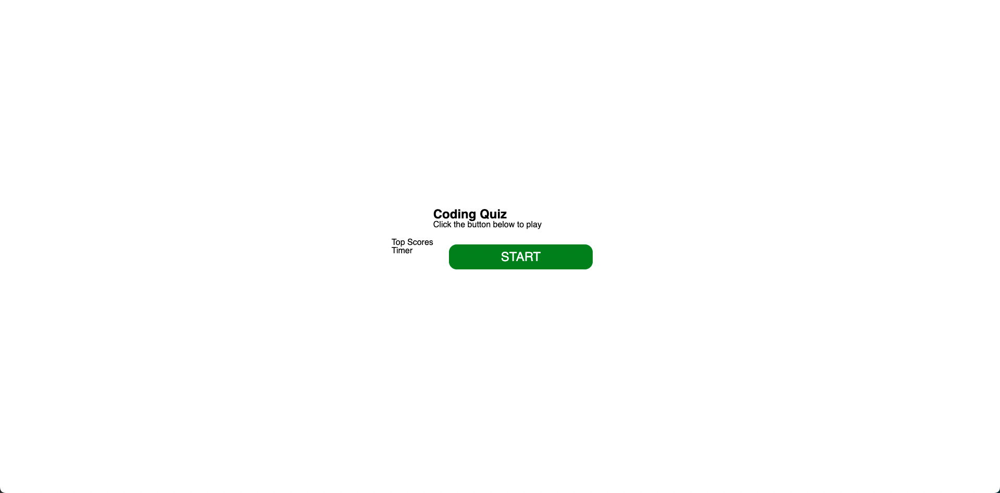
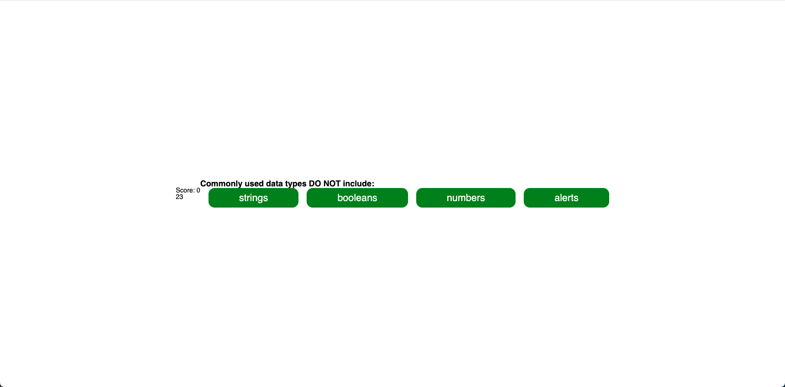
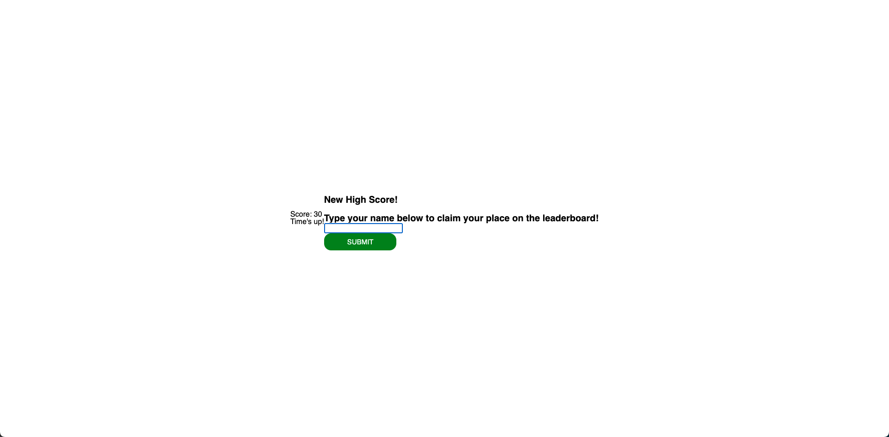
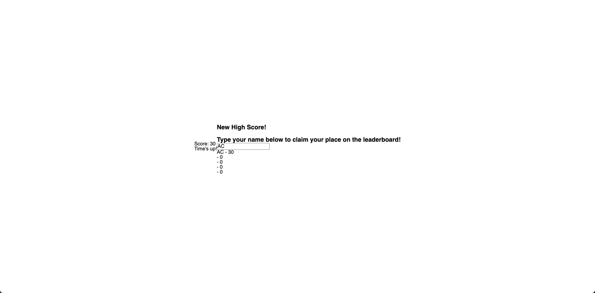
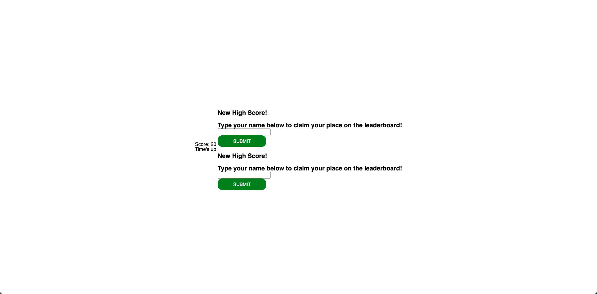

This site is deployed at: https://andcooke.github.io/coding-quiz/

This was created on July 2, 2022.

# DESCRIPTION
This is a rough mock-up of a quiz that allows users to answer questions. There is a timer, and the page keeps a score of correct answers. 

# USAGE

The page starts on a welcome screen with a button to start the game.

When the user clicks the button, the questions begin.

The user clicks the buttons to select the answer they think is correct.

If the user is correct, the score adds 10.
If the user is wrong, 10 seconds come off the clock.

At the end the user can type their name to put themselves on the leaderboard.

Then the leaderboard is presented.

# LESSONS LEARNED

My primary lesson here was how to get HTML elements and manipulate them through javascript. Also, implemented my first setInterval function. 

# IMPROVEMENTS
There are 2 main improvements that I could make here:

1. Set up local storage so that user can save scores. This would also fix the issue of the user always getting a high score.
2. Set up some sort of style sheet. 
3. When the user scores 20, the screen which allows the user to input their name for the leaderboard, prints 2 of everything.

My intent is to remake this at a later date with all features fully in tact and a more polished look. 

# CREDITS

-Meg Meyers: https://github.com/femke77

-Andrew Cooke: https://github.com/andcooke